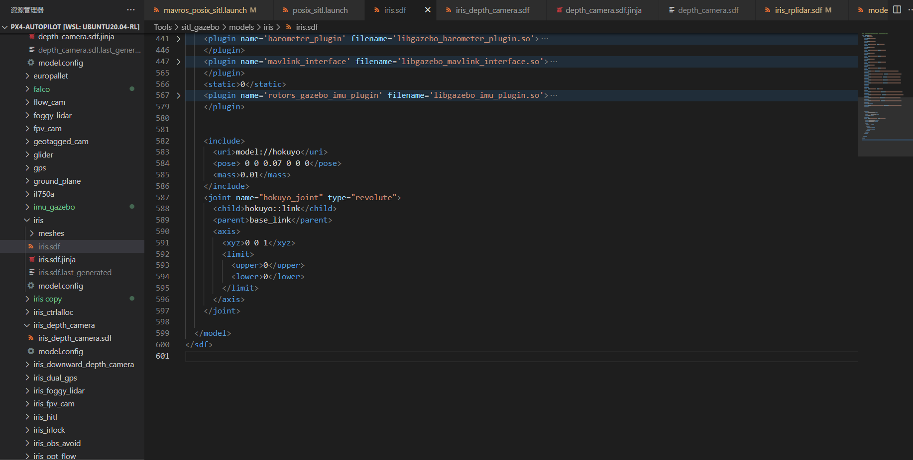
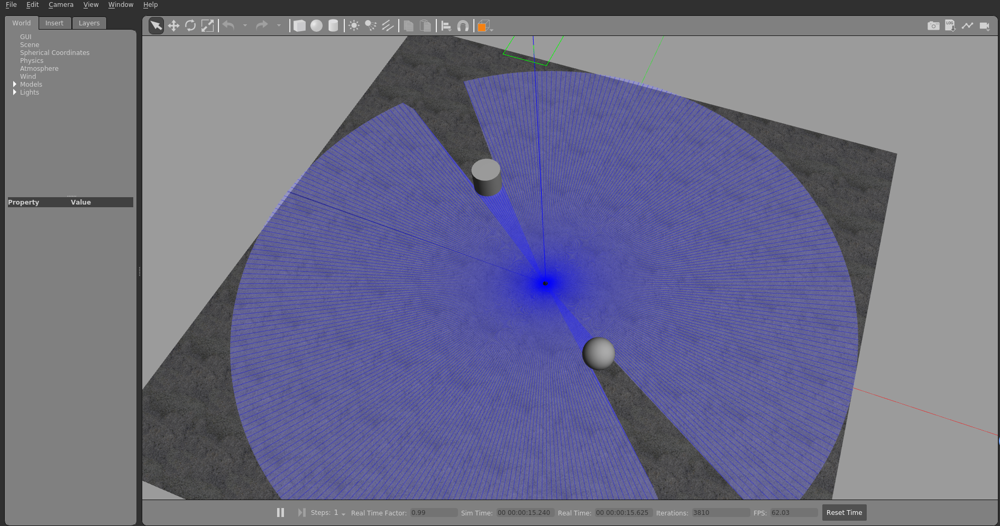
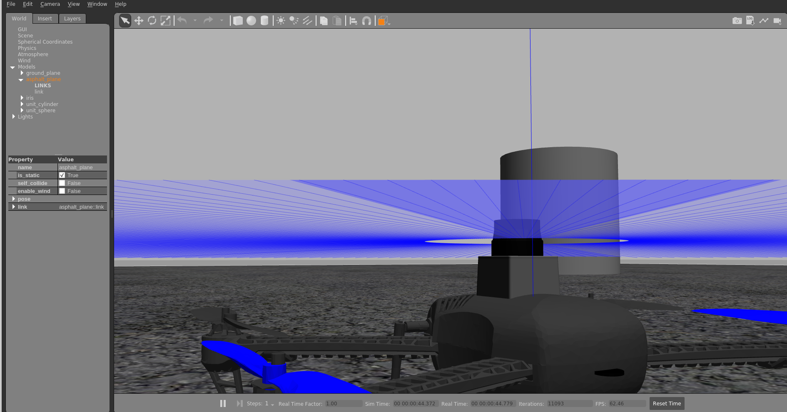

# How to install

## 1. Download

```
cd

mkdir -p .gazebo/models/

cd .gazebo/models/
 
git clone https://github.com/yabanbingliang/gazebo_models.git

mv gazebo_models/* ./

sudo rm -rf gazebo_models
 
```

## 

## 2. change PX4

```
cd ~/PX4-Autopilot/Tools/sitl_gazebo/models/iris

gedit iris.sdf
```

add below at last

```xml
<include>
  <uri>model://hokuyo</uri>
  <pose> 0 0 0.07 0 0 0</pose>
  <mass>0.01</mass>
</include>
<joint name="hokuyo_joint" type="revolute">
  <child>hokuyo::link</child>
  <parent>base_link</parent>
  <axis>
    <xyz>0 0 1</xyz>
    <limit>
      <upper>0</upper>
      <lower>0</lower>
    </limit>
  </axis>
</joint>
```

eg




## 3. start 

```
 roslaunch px4 mavros_posix_sitl.launch
```

eg





## 4. Reference


This repository holds the [Gazebo](http://gazebosim.org) model database.

Learn more about the database [here](http://gazebosim.org/tutorials?tut=model_structure&cat=build_robot).

Learn how to contribute models [here](http://gazebosim.org/tutorials?tut=model_contrib&cat=build_robot).
